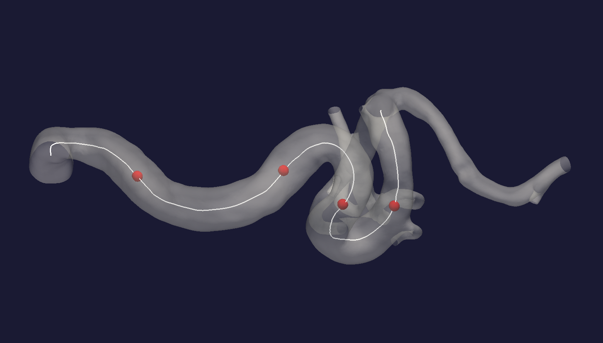

.. title:: Miscellaneous

=============
Miscellaneous
=============

Landmarking of the carotid siphon
=================================
Landmarking of the geometry is performed in order to identify different segments of the vessel. 
Identification of specific segments is required in order to perform geometric manipulation. 
The script ``automated_landmarking.py`` includes implementation of two automated landmarking algorithms;
the first introduced by Piccinelli et al. (2011), the second by Bogunović et al. (2014). 

Both landmarking algorithms rely on geometric properties of the centerline. 
The script allows the user to select one of four different methods to compute the curvature
of the discrete centerline:

1. B-Splines (``spine``)
2. Free-knot regression splines (``freeknot``)
3. Discrete derivatives (``disc``)
4. VMTK (``vmtk``) 

.. todo:: 
    Add references to different splining techniques?

To perform landmarking, run the following command::

    python automated_landmarking.py --dir_path [PATH_TO_CASES] --algorithm [ALGORITHM] --curv_method [METHOD]

This will produce ``landmark_ALGORITHM_CURVMETHOD.particles`` which contains four points defining the interfaces between the segments of the vessel.

  Figure 4: Landmarked geometry, with interfaces shown as red spheres.

Selection of compression / extension factors
============================================
The compression / extension factors :math:`\alpha \text{ and } \beta` determine the magnitude and direction in which the anterior bend is translated. 
Running the scripts  ``automated_geometric_quantities.py`` and ``calculate_alpha_beta_values.py`` is required if the user is interested in reaching a spesific change in angle or curvature.

Common
======
Wrapping vtk and vmtk functionalty.
