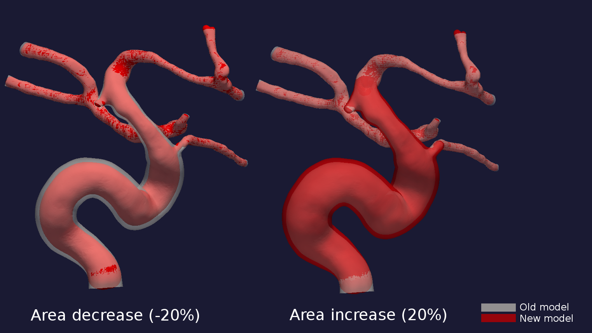

.. title:: Tutorial: Manipulate area

=========================
Tutorial: Manipulate area
=========================
Manipulation of the cross-sectional area is performed by running the script ``area_variations.py``.
[\\]: <> (The script performs geometric manipulation of the cross sectional area, represented by a centerline.)
In order to preserve the inlet and the end of the geometry segment, the first and last 10% of the area of interest are left unchange. 

The script ``area_variations.py`` includes several options for area variations:

* Area variations
* In-/deflation
* Stenosis creation/removal

.. NOTE: manipulate_area.py is easy to extend with new features. Please make a pull request with changes, or contact the developers for help with extending the method.

Area variations
===============

Tulle illustrasjon av geometrien

Focus on R, and not beta.

Area variation is initialized by a factor :math:`\beta` or a ratio, :math:`R = A_{min} / A_{max}`. 
The script takes ``beta`` and ``ratio`` as command line arguments.
However, the script requires only one of the two parameters to perform area variation. 
Setting :math:`\beta < 0` will cause the ratio :math:`R` to decrease,  whereas :math:`\beta > 0` will cause the ratio to increase. 
The ratio, :math:`R`, behaves as shown in the illustration below. 

Examplified in Figure 3, where the ICA is defined as the region of interest.

To perform area variations of the vessel area, run the following command::
    
    python area_variations.py --dir_path [PATH_TO_CASES] --case [CASENAME] --smooth True --beta 0.5

or::

    python area_variations.py --dir_path [PATH_TO_CASES] --case [CASENAME] --smooth True --ratio 0.5

.. figure:: area_vary.png

  Figure : Area variations throughout the geometry for different ratios. 

Comment to the Figure: Old, new --> original and manipulated.

Overall area variation
======================

The area of interest can also be increase or decreased overall, by using the ``percentage`` argument. 
The ``percentage`` argument determines the percentage to increase or decrease the overall area.

To perform overall increase or decrease of the area of interest, run the following command::
    
    python area_variations.py --dir_path [PATH_TO_CASES] --case [CASENAME] --smooth True --percentage [%]

Below is an illustration of area decrease and increase in a single patient-specific model. 

  Figure : Decrease and increase in overall area.

Stenosis creation / removal
===========================

The framework allows for creation or removal of one stenosis located along the area of interest.  
Creation and removal of a stenosis is performed by specifying input argument ``stenosis`` to **True**.
Spesifically for stenosis creation, the input arguments ``percentage`` and ``length`` determine the area reduction and length of the stenosis, respectively. 
The ``length`` argument is multiplied with the radius at the selected center point of the stenosis, to expand the stenosis exposed area.

Comment KVS: Upstream and downstream. Write sine function, can easly be modified in the script.

For creation of a stenosis, run the follwing command::
    
    python area_variations.py --dir_path [PATH_TO_CASES] --case [CASENAME] --smooth True --percentage [%] --stenosis True --size [SIZE]

Running this command will cause a render window to appear, asking (replace!) you to specify points on the surface which will act as the center point of the stenosis. 
This will trigger the following prompt, with a suggested point placement:

.. figure:: single_stenosis.png

  Figure : Placing point where stenosis is centered. 

.. figure:: change_stenosis.png

  Figure : Comparison of new and old model, with and without stenosis.

Similarly, removal of a stenosis is achieved by running the command:: 
    
    python area_variations.py --dir_path [PATH_TO_CASES] --case [CASENAME] --smooth True --stenosis True 

The command will cause a render window to appear, asking you to specify points on the surface which will now act as the boundaries of the stenosis. 

Comment: Linear change in area between the two points.

This will trigger the following prompt, with a suggested point placement:

.. figure:: place_stenosis.png

  Figure : Placing points to indentify the boundaries of the stenosis.

.. figure:: fixed_stenosis.png

  Figure : Comparison of new and old model, with and without stenosis. 
