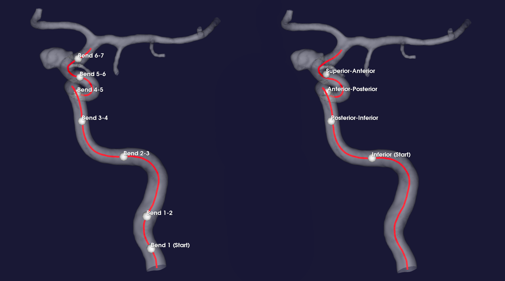

.. title:: Miscellaneous

=============
Miscellaneous
=============

.. _landmarking:

Landmarking of the internal carotid artery
==========================================
The internal carotid artery can be classified, or landmarked, into segments.
For an *objective* and *reproducible* manipulation of the segment
historically referred to as the carotid siphon, we have implemented two
previously published methods for landmarking: Piccinelli et al.
(2011) [1]_, and Bogunović et al. (2014) [2]_ (``--algorithm``).

Although the algorithms are well described in both articles, neither state
how the centerlines are computed, or how the curvature and torsion is derived.
Both algorithms are very sensitive to the input curvature and torsion, and
are therefore not directly reproducible. In Kjeldsberg 2018 [3]_ there is a
a thorough comparison between landmarking algorithms, input parameters,
and centerline smoothing methods which can help you to choose the correct
options for your application.

The script ``automated_landmarking.py`` has three methods for computing
the discrete derivatives of the centerline curve, set with
``--approximation-method``.

 1. B-Splines (``spine``)
 2. Discrete derivatives (``disc``)
 3. VMTK (``vmtk``)

To perform landmarking, we will be using the model with `ID C0001 <http://ecm2.mathcs.emory.edu/aneuriskdata/download/C0001/C0001_models.tar.gz>`_
from the Aneurisk database. For the commands below we assume that there is a file `./C0001/surface/model.vtp`, relative to where you execute the command.
To landmark the surface model, run the following command::

    python automated_landmarking.py --ifile C0001/surface/model.vtp --algorithm bogunovic --approximation-method spline --nknots 8

The command will output a file ``C0001/surface/landmark_[ALGORITHM]_[APPROXIMATION_METHOD].particles``
which contains four points defining the interfaces between the segments of the vessel.

  Figure 1: Landmarked geometry, with interfaces shown as red spheres along the white centerline.

.. _compute_alpha_beta:

Compute alpha and beta
======================
Please see :ref:`manipulate_bend` for a definition of :math:`\alpha` and :math:`\beta`.

Instead of directly setting the extent the model should be moved (``--alpha`` and ``--beta``),
it is more convenient to control a morphological parameter like maximum curvature, or the
angle in the bend.

The idea behind ``estimate_alpha_beta_values.py`` is to use the centerline as a
proxy for the new geometry, used to compute quantities such as curvature or bend angle.
For estimation of :math:`\alpha` and :math:`\beta`, the script
manipulates only the centerline for a range of ``--alpha`` and
``--beta`` values. The resulting 2D data can be fitted to a surface through cubic spline interpolation, from
which one can easily collect appropriate values for ``--alpha`` and ``--beta``.

To estimate :math:`\alpha` and :math:`\beta`, we will be using the model with `ID C0005 <http://ecm2.mathcs.emory.edu/aneuriskdata/download/C0005/C0005_models.tar.gz>`_
from the Aneurisk database. For the commands below we assume that there is a file `./C0005/surface/model.vtp`, relative to where you execute the command.

Imagine we are interested in changing the bend angle by :math:`\pm 10^{\circ}`.
To find appropriate values for :math:`\alpha` and :math:`\beta`, we can run the script through the following command::

    python estimate_alpha_and_beta.py --ifile C0005/surface/model.vtp --quantity angle --value-change 10 --grid-size 25 --region-of-interest commandline --region-points 49.9 41.3 37.3 48 50.3 38.2

The command will output a file ``./C0005/surface/model_alphabeta_values.txt``
which contains two :math:`(\alpha, \beta)` - pairs, corresponding to the appropriate values resulting in plus and minus
the desired change in angle.
Thus we can proceed  manipulation of the bend as described in :ref:`manipulate_bend`.

The algorithm can also be tweaked to get the initial value for the chosen quantity, as well as adding additional
geometric quantities to compute for.
For more information on the input parameters in the script, see :meth:`automated_landmarking.automated_landmarking`.
For a more detailed description of the method, please see [3]_.

Common
======
In the folder ``common`` we have collected utility scripts containing generic functions used by multiple scripts.
Many of the functions wrap existing vtk and vmtk functions in a more pythonic syntax,
collected in ``vtk_wrapper.py`` and ``vmtk_wrapper.py``, respectively.
Instead of writing 6-7 lines of code to initiate a vtk-object, and set each parameter,
and the input surface, one may call one function with multiple arguments instead,
see for instance :meth:`vtk_wrapper.vtk_compute_threshold`.

In addition to wrapping vtk and vmtk functionality, there is also new methods for
manipulating centerlines, surface models and Voronoi diagrams, collected in their respective scripts.

.. [1] Piccinelli, M., Bacigaluppi, S., Boccardi, E., Ene-Iordache, B., Remuzzi, A., Veneziani, A. and Antiga, L., 2011. Geometry of the internal carotid artery and recurrent patterns in location, orientation, and rupture status of lateral aneurysms: an image-based computational study. Neurosurgery, 68(5), pp.1270-1285.
.. [2] Bogunović, H., Pozo, J.M., Cárdenes, R., Villa-Uriol, M.C., Blanc, R., Piotin, M. and Frangi, A.F., 2012. Automated landmarking and geometric characterization of the carotid siphon. Medical image analysis, 16(4), pp.889-903.
.. [3] Kjeldsberg, Henrik Aasen. Investigating the Interaction Between Morphology of the Anterior Bend and Aneurysm Initiation. MS thesis. 2018.
