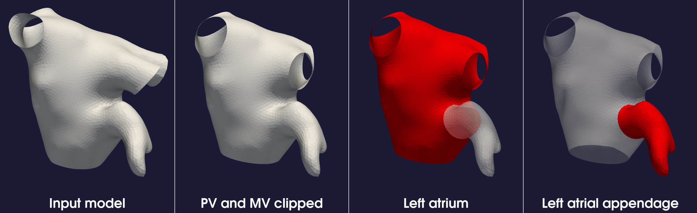

.. title:: Tutorial: Landmarking the atrium

.. _landmark_atrium:

=====================================
Tutorial: Landmarking the left atrium
=====================================

This tutorial explains how to use the ``landmark_atrium`` function to extract and separate the left atrium and left atrial appendage from 3D models of the heart. The functionality is split into two main tasks: extracting the left atrium and appendage, and separating the left atrium and appendage.

The following Python script is used to perform this operation. The script is part of the ``morphman`` package, and it utilizes various VTK-based functions for manipulating and processing heart models. We also show how to call this script from the command line using ``morphman-landmark``.

The script accepts the following input arguments:

 * ``input_path``: Path to the folder containing the model files (required).
 * ``resampling_step``: The length for centerline resampling (required).

The output of the script is two separate ``.vtp`` files: one for the left atrium (LA) and one for the left atrial appendage (LAA).

The ``extract_left_atrium_and_appendage`` function detects and isolates the left atrial appendage (LAA) from the left atrium lumen based on the cross-sectional area along centerlines.

**Code Reference**:

.. code-block:: python

   def extract_left_atrium_and_appendage(input_path, resampling_step):
       """
       Detect the left atrial appendage and isolate it from the atrium lumen.

       Args:
           input_path (str): Path to folder with model files.
           resampling_step (float): Resampling length for centerline resampling.
       """
       # Load model file
       surface = read_polydata(input_path)

       # Compute centers and process centerlines
       inlet, outlets = compute_centers(surface)
       la_centerlines, _, _ = compute_centerlines(inlet, outlets, resampling=resampling_step)

       # Clip Pulmonary Veins (PVs)
       surface = clip_pvs()

       # Clip Mitral valve (MV)
       surface = clip_mv()

       # Finalize and save the clipped surface
       write_polydata(surface, input_path.replace(".vtp", "_la_and_laa.vtp"))

The ``separate_left_atrium_and_appendage`` function separates the left atrium from the appendage by clipping the regions based on a cross-sectional area along the centerlines.

**Code Reference**:

.. code-block:: python

   def separate_left_atrium_and_appendage(input_path, resampling_step):
       """
       Separate the left atrium from the appendage.

       Args:
           input_path (str): Path to folder with model files.
           resampling_step (float): Resampling length for centerline resampling.
       """
       # Load model file
       surface = read_polydata(input_path)

       # Compute centers and process centerlines
       inlet, outlets = compute_centers(surface)
       laa_centerline, _, _ = compute_centerlines(inlet, provide_point(surface), resampling=resampling_step)

       # Clip and extract the left atrium and appendage
       surface, laa_surface = clip_and_separate(surface, laa_centerline)

       # Save the separated surfaces
       write_polydata(laa_surface, input_path.replace(".vtp", "_laa.vtp"))
       write_polydata(surface, input_path.replace(".vtp", "_la.vtp"))

To run the script, you need to pass the input path of the model files and the desired resampling step size for centerline extraction.

Example:

::

    python landmark_atrium.py --input-path /models/model.vtp

or

::

    morphman-landmark --input-path /models/model.vtp

This will output two files in the same folder:

 * ``model_la.vtp``: Contains the left atrium.
 * ``model_laa.vtp``: Contains the left atrial appendage.

Below is an illustration of an atrium model having undergone landmarking.

  Figure 1: Steps of landmarking the left atrium and the left atrial appendage.

For more details on the algorithm used in this script, refer to the original paper by Tobon-Gomez et al. [1]_

For additional information, beyond this tutorial, on the script and input parameters, please run ``morphman-landmark --help`` or consult the API documentation.

.. [1] Tobon-Gomez, Catalina, et al. "Benchmark for algorithms segmenting the left atrium from 3D CT and MRI datasets." IEEE transactions on medical imaging 34.7 (2015): 1460-1473.
