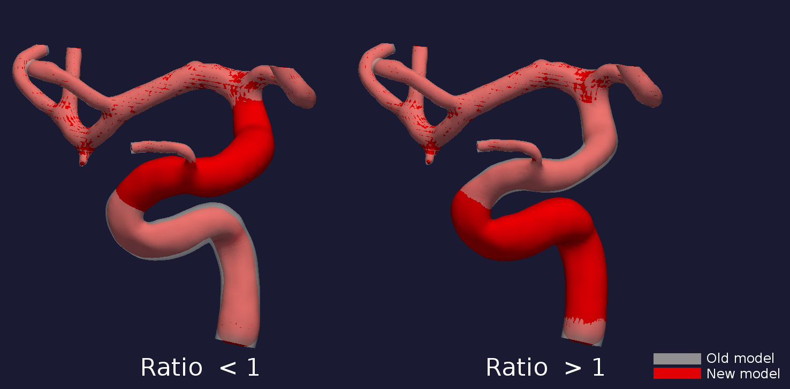
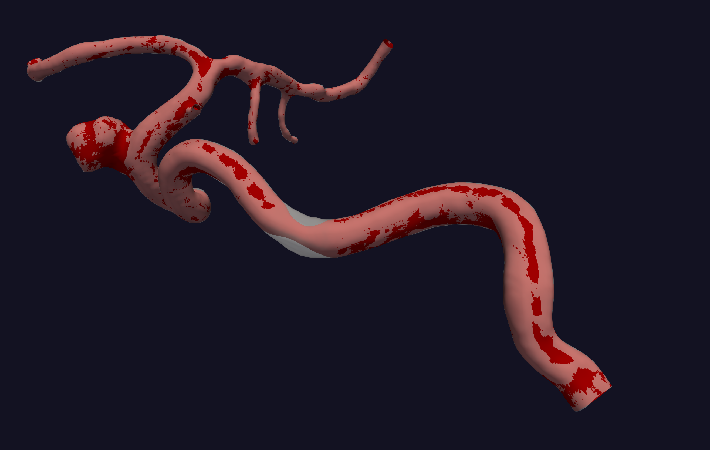
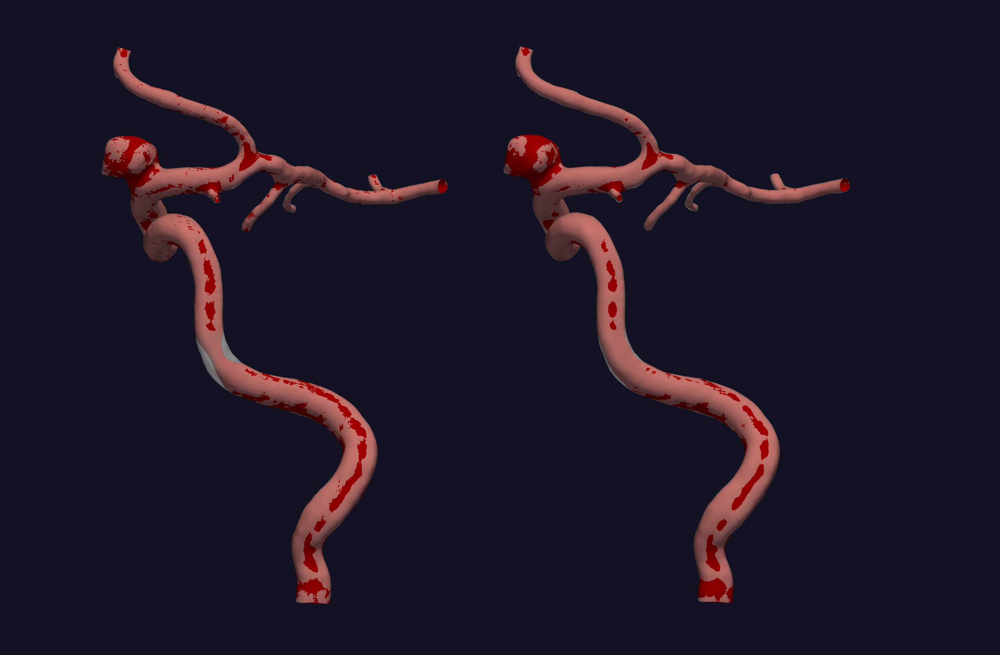

.. title:: Tutorial: Manipulate area

.. _manipulate_area:

=========================
Tutorial: Manipulate area
=========================
Manipulation of the cross-sectional area is performed by running the script ``manipulate_area.py``. 
In this tutorial, we are using the model with `ID C0001 <http://ecm2.mathcs.emory.edu/aneuriskdata/download/C0001/C0001_models.tar.gz>`_
from the Aneurisk database. For the commands below we assume that there is a folder a `./C0001/surface/model.vtp`
, relative to where you execute the command.

For changing the area you first need to define which segment you want to alter. For ``manipulate_area.py`` there are
three choices:

 * Manual selection, based on clicking on a surface
 * Provide the points on the centerline
 * Pass the argument ``--region-of-interest first_line``, which simply chooses the section between the inlet and the first bifurcation. Note: This option is not possible for creating or removing a stenosis.

There are three different methods for altering the cross-sectional area:

 * Increase or decrease the area variation.
 * Inflation of deflation of a vessel.
 * Create or remove a `stenosis <https://en.wikipedia.org/wiki/Stenosis>`_.

``manipulate_area.py`` is easy to extend with new features. Please make a pull request with changes,
or create an issue suggesting an enhancement. the developers for help with extending the method.

.. _area_variations:

Area variations
===============
The goal of this method is to increase or decrease the variation of the cross-sectional area along an arterial segment.
Shown in Figure 1, is a drawing of the desired output. More specifically, we would like to control R, the ratio between the largest
and smallest area. The area is changed with a factor :math:`F`, which is controlled by a factor :math:`\beta`.

.. figure:: illustration_area.png

        Figure 1: A drawing of what we would like to happen.

For changing the cross-sectional area variation you can either provide the desired :math:`R` you want (``--ratio``),
or specify :math:`\beta` (``--beta``). Note that :math:`\beta > 0` increases, and :math:`\beta < 0` decreases the
variability.

To output a plausible geometry the first and last 10 % is a linear transition between the manipulated and original geometry.
However, if you choose ``--region-of-interest first_line``, only the end of the line changes.

Figure 2, shows a possible output of the algorithm, where the internal coratid artery was is defined as the region of interest, and were obtain by running::

    python area_variations.py --ifile C0001/surface.vtp --ofile C0001/increased_variation.vtp --method variation --ratio 3.0 --region_of_interest first_line

For the model with increased cross-sectional area variation, and::

    python area_variations.py --ifile C0001/surface.vtp --ofile C0001/increased_variation.vtp --method variation --ratio 1.4 --region_of_interest first_line

For the model with decreased cross-sectional area variation.

  Figure 2: Area variations throughout the geometry for different ratios. 

Create / remove a stenosis
==========================
A stenosis is a local narrowing of the vessel, often caused by the buildup of plaque. You can manipulate a stenosis with 
``manipulate_area.py`` by setting ``--method stenosis`` as an additional command line argument.

Create a stenosis
~~~~~~~~~~~~~~~~~
For creating a stenosis you need to define the center, either by providing the point manually or using ``--stenosis-points``.
The stenosis will be upstream and downstream of the center, with ``--length`` times the local minimal inscribed sphere, and 
``--percent`` controls how much the local radius should be changed. For instance, if ``--percent 50`` is provided as an argument,
the stenosis will have an area in the middle of stenosis of :math:`(\frac{1}{2}r)^2\pi`, where :math:`r` is the radius of the area in the
original geometry.

The stenosis is now assumed to have a sinusoidal shape. However, altering the shape is trivial,
and can be done by adapting one line in the function :meth:`manipulate_area.get_factor`.

.. ``get_factor`` in ``manipulate_area.py``.

In Figure 3 you can see the output of the script. Of note is that creating a stenosis in sections with high curvature,
like the carotid siphon, is unproblematic.

  Figure 3: Comparison of the new and old model, with and without stenosis.

To recreate the above output, execute the following on the commandline line::
    
    python manipulate_area.py --ifile C0001/surface.vtp --ofile C0001/stenosis.vtp --smooth True --method stenosis --stenosis-point x y z --percentage 50 --size 1

Remove stenosis
~~~~~~~~~~~~~~~
To remove a stenosis, you need to provide two points, one at each end of the stenosis. The area will be changed to alter
linearly over the chosen region of interest.

To exemplify this, we can use the output from the previous example ``C0001/stenosis.vtp``.
To the left in Figure 4a you can see the stenosed model compared to the original, and to the
right the comparison of the original model and the one where we have removed the stenosis.

  Figure 4: Comparison of new and old model, with and without stenosis. 
    
To reproduce the above result, execute the following command::

    python manipulate_area.py --ifile C0001/stenosis.vtp --ofile C0001/no_stenosis.vtp --smooth True --method stenosis --stenosis-point x y z x y z

Inflation / deflation of an arterial segment
============================================
The area of interest can also be inflated or decflated. To do so, pass the argument ``--method area``, and 
set the percentage change with ``--percentage``. Like with :ref:`area_variations` the first and last 10 % of the 
region of interest is a transition between the original and modified geometry to ensure smooth transitions.

To perform a deflation run the following command::
    
    python manipulate_area.py --ifile C0001/surface.vtp --ofile C0001/inflated.vtp --smooth True --percentage -20 --method area --region-of-interest first_line

Below is an illustration of area decrease and increase in a single patient-specific model.

.. figure:: area_decinc.png

  Figure 5: Decrease and increase in overall area.

For additional information, beyond this tutorial, on the script and
input parameters, please run ``python manipulate_area.py -h`` or conr with
the :ref:`api_documentation`.
