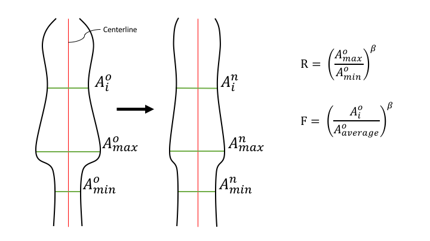
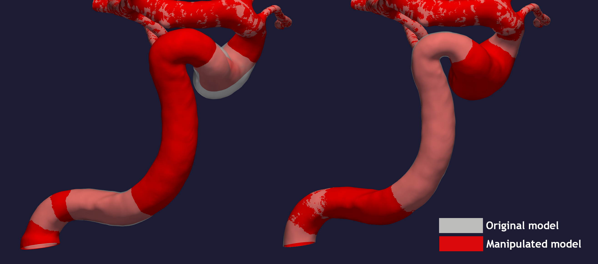
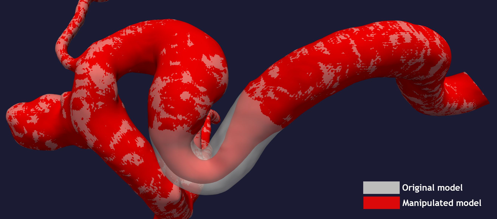
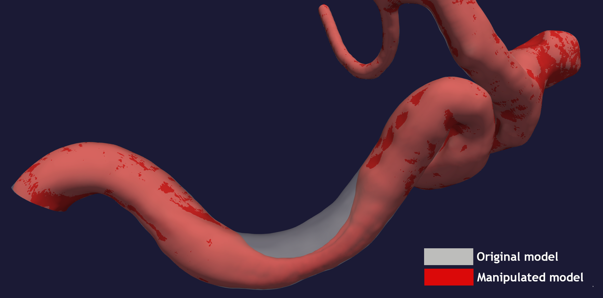
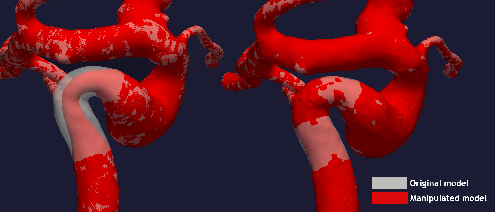
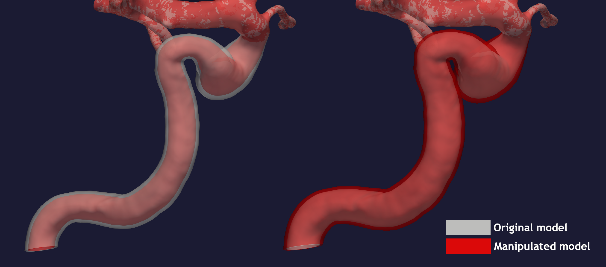

.. title:: Tutorial: Manipulate area

.. _manipulate_area:

=========================
Tutorial: Manipulate area
=========================

Manipulation of the cross-sectional area is performed by running ``morphman-area`` in the terminal, followed by the
respective command line arguments. Alternatively, you can execute the Python script directly,
located in the ``morphman`` subfolder, by typing ``python manipulate_area.py``. We have also created a
demo folder where we show how to run this tutorial from a Python script, please check out the code from GitHub to
run the demos.

In this tutorial, we are using the model with
`ID C0002 <http://ecm2.mathcs.emory.edu/aneuriskdata/download/C0002/C0002_models.tar.gz>`_
from the Aneurisk database. For the commands below we assume that there is a file `./C0002/surface/model.vtp`, relative to where you execute the command.

For changing the area you first need to define which segment you want to alter. For ``morphman-area`` there are
three choices you can set with ``--region-of-interest``:

 * ``manual``: Manual selection, based on clicking on a surface
 * ``commandline``: Provide the points on the centerline
 * ``first_line``: The section between the inlet and the first bifurcation. Note: This option is not possible for creating or removing a stenosis.

After choosing which segment to manipulate, you have to set how you want to manipulate the cross-sectional area.
There are three methods, which can be set with ``--method``:

 * ``variation``: Increase or decrease the area variation.
 * ``stenosis``: Create or remove a `stenosis <https://en.wikipedia.org/wiki/Stenosis>`_.
 * ``area``: Inflation or deflation of a vessel.

It is easy to extend :meth:`manipulate_area.get_factor` with new features. Please make a pull
request with changes, or create an issue suggesting an enhancement, and we will look into it.

.. _area_variations:

Area variations
===============
The goal of this method is to increase or decrease the variation of the cross-sectional area
along an arterial segment. Shown in Figure 1, is a drawing of a decrease in cross-sectional area
variation, and the desired output from the script. More specifically, we would like to control R,
the ratio between the largest and smallest area. For each point along the centerline the
radius is multiplied with a factor F, controlled by :math:`\beta`.
For changing the cross-sectional area variation you can either provide the desired R
you want (``--ratio``), or specify :math:`\beta` (``--beta``). Note that :math:`\beta > 0`
increases, and :math:`\beta < 0` decreases the variability.

        Figure 1: A drawing of what we would like to happen.

To output a plausible geometry the first and last 5 % of the region of interest is
a linear transition between the manipulated and original geometry. However,
if you choose ``--region-of-interest first_line``, only the end has a smooth transition.

Figure 2 shows a possible output of the algorithm, where the region of interest was set to ``first_line``,
obtained by executing the following commands from the command line::

    morphman-area --ifile C0002/surface/model.vtp --ofile C0002/surface/increased_variation.vtp --method variation --ratio 4.0 --region-of-interest first_line --poly-ball-size 250 250 250

for the model with increased cross-sectional area variation, and::

    morphman-area --ifile C0002/surface/model.vtp --ofile C0002/surface/decreased_variation.vtp --method variation --ratio 1.0 --region-of-interest first_line --poly-ball-size 250 250 250

for the model with decreased cross-sectional area variation.

  Figure 2: Area variations throughout the geometry for different ratios. 

Create / remove a stenosis
==========================
A stenosis is a local narrowing of the vessel, often caused by the buildup of plaque.
You can manipulate a stenosis with  ``morphman-area`` by setting ``--method stenosis``.

Create a stenosis
~~~~~~~~~~~~~~~~~
For creating a stenosis you need to define the center, either by providing the point
manually or using ``--region-points``. The stenosis will be upstream and downstream
of the center, with a length (``--size``) times the local maximal inscribed sphere, and  ``--percentage``
controls how much the local radius should be changed. For instance, if ``--percentage 30``
is provided as an argument, the stenosis will have an area in the middle of stenosis of
:math:`(0.7 \cdot r)^2\pi`, where :math:`r` is the radius of the area in the original geometry.
An additional feature includes introducing an asymmetric stenosis, by setting the ``--angle-asymmetric`` flag
to a desired angle, :math:`\theta \in [0, 360 ]`.

The stenosis is now assumed to have a sinusoidal shape. However, altering the shape is trivial,
and can be done by adapting one line in the function :meth:`manipulate_area.get_factor`.

In Figure 3 you can see the output of the script. Of note is that creating a stenosis in
sections with high curvature, like the internal carotid artery, is unproblematic.

  Figure 3: Comparison of the new and old model, with and without stenosis.

To recreate the above output, execute the following from the commandline::

    morphman-area --ifile C0002/surface/model.vtp --ofile C0002/surface/stenosis.vtp --method stenosis --size 4 --percentage 50 --region-of-interest commandline --region-points 28.7 18.4 39.5 --poly-ball-size 250 250 250

Alternatively, you can introduce an asymmetric stenosis by setting the ``--angle-asymmetric`` flag
to a desired angle, :math:`\theta \in [0, 360 ]`. The selected value of :math:`\theta` determines where the surface
is unaffected, relative to the region point.

In Figure 4 you can see the output of creating an asymmetric stenosis, with an asymmetric angle of 90 degrees.

  Figure 4: Comparison of the new and old model, with and without an asymmetric stenosis.

To recreate the above output, execute the following from the commandline::

    morphman-area --ifile C0002/surface/model.vtp --ofile C0002/surface/asymmetric_stenosis.vtp --method stenosis --angle-asymmetric 90 --size 6 --percentage 75 --region-points 23.83 4.66 38.33 --poly-ball-size 250 250 250

Remove a stenosis
~~~~~~~~~~~~~~~~~
To remove a stenosis, you need to provide two points, one at each end of the
stenosis. The area will be altered to change linearly between the two points.

To exemplify this, we can use the output from the previous example ``C0002/surface/stenosis.vtp``.
To the left in Figure 5 you can see the stenosed model compared to the original, and to the
right, the comparison between the original model and the 'healed' surface.

  Figure 5: Comparison between the original model in white with opacity, and the modified models in red.
    
To reproduce the above result, execute the following command::

    morphman-area --ifile C0002/surface/stenosis.vtp --ofile C0002/surface/stenosis_removed.vtp --method stenosis --region-of-interest commandline --region-points 30.1 18.5 34.6 27.1 12.7 38.2 --poly-ball-size 250 250 250

Inflation / deflation of an arterial segment
============================================
The area of interest can also be inflated or deflated. To do so, pass the argument ``--method area``, and
set the percentage change with ``--percentage``. Like with :ref:`area_variations`, the first and last 5 % of the
region of interest is a transition between the original and modified geometry to ensure smooth transitions.

To perform a deflation, run the following command::

    morphman-area --ifile C0002/surface/model.vtp --ofile C0002/surface/area_deflated.vtp --method area --percentage -20 --region-of-interest first_line --poly-ball-size 250 250 250

Similarly, we can perform inflation by changing the sign of the ``--percentage`` argument.
To reproduce the inflated model shown in Figure 5, you can run the command::

    morphman-area --ifile C0002/surface/model.vtp --ofile C0002/surface/area_inflated.vtp --method area --percentage 20 --region-of-interest first_line --poly-ball-size 250 250 250

Below is an illustration of area decrease and increase in a single patient-specific model.

  Figure 5: Decrease and increase in overall area.

For additional information, beyond this tutorial, on the script and
input parameters, please run ``morphman-area -h`` or confer with
the API documentation for :meth:`manipulate_area`.
