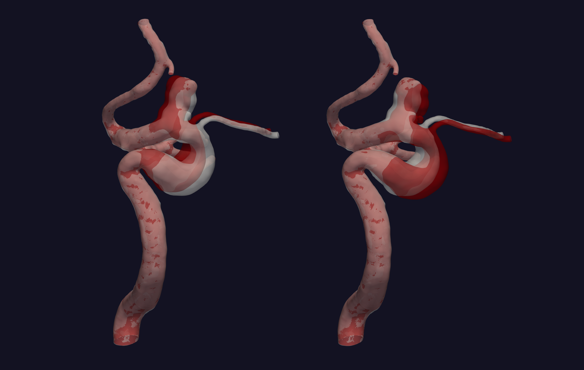

.. title:: Tutorial: Manipulate bend

.. _manipulate_bend:

=========================
Tutorial: Manipulate bend
=========================

The goal of ``manipulate_bend.py``, is to alter one specific bend in the
vasculature, like shown in Figure 1.

.. figure:: Bend_moving.png

   Figure 1: Illustration of how we would like to alter a bend.

As shown in Figure 1, we have defined two directions to move a bend in:
:math:`\alpha` and :math:`\beta`. The input parameters ``--alpha`` and
``--beta`` controll the distance to move the geometry in each direction,
respectivly. For a detailed description on how we have defined of the
vectors :math:`\alpha` and :math:`\beta`, see [1]_.

In this tutorial, we are using the model with
`ID C0002 <http://ecm2.mathcs.emory.edu/aneuriskdata/download/C0002/C0002_models.tar.gz>`_
from the Aneurisk database. For the commands below we assume that there is a folder
a `./C0002/surface/model.vtp`, relative to where you execute the command.

The region of interest can be set by controlling ``--region-of-interest``
with three different options:

  * ``manual``, provide the start and end of the bend by selecting points interacticly
  * ``commandline``, provide two points on the commandline through ``--region-points``
  * ``landmarking``, only valid for the internal carotid artery, execute ``landmarking.py`` prior to running ``manipulate_bend.py``, see :ref:`landmarking`.

Figure 2 depicts an example of modifying the input surface in the :math:`\alpha` ('horizontal') direction only.

  Figure 2: Movement in the horizontal direction, determined by :math:`\alpha`.

To recreate the surfaces shown in Figure 2, run the two following commands::
    
    python manipulate_bend.py --ifile C0002/surface/model.vtp --ofile C0002/surface/bend_alpha.vtp --alpha 0.2 --region-of-interest commandline --region-points x y z x y z
    python manipulate_bend.py --ifile C0002/surface/model.vtp --ofile C0002/surface/bend_alpha.vtp --alpha -0.2 --beta 0.2 --region-of-interest commandline --region-points x y z x y z

Shown in Figure 3 is the output of changing the surace in the
:math:`\beta` ('vertical') direction only.

.. figure:: beta.png

  Figure 3: Movement in the vertical direction, determined by :math:`\beta`.

As shown above, the scripts changes the bend as expected, but in general
what would be natural to control is not the distances, but rather a 
morphological parameter like the maximum curvature, or the 'angle' between
the segments. We have therefore added an extra script ``calculate_alpha_and_beta.py``
that can *a priori* find approporiate values for :math:`\alpha` and :math:`\beta` given a
target maximum curvature or angle. Please see :ref:`compute_alpha_beta` for more information.

For additional information, beyond this tutorial, on the script and input parameters,
please run ``python manipulate_bend.py -h`` or confer with the :ref:`manipulate_bend`.

.. [1] Kjeldsberg, Henrik Aasen. Investigating the Interaction Between Morphology of the Anterior Bend and Aneurysm Initiation. MS thesis. 2018.
