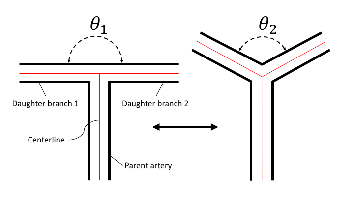
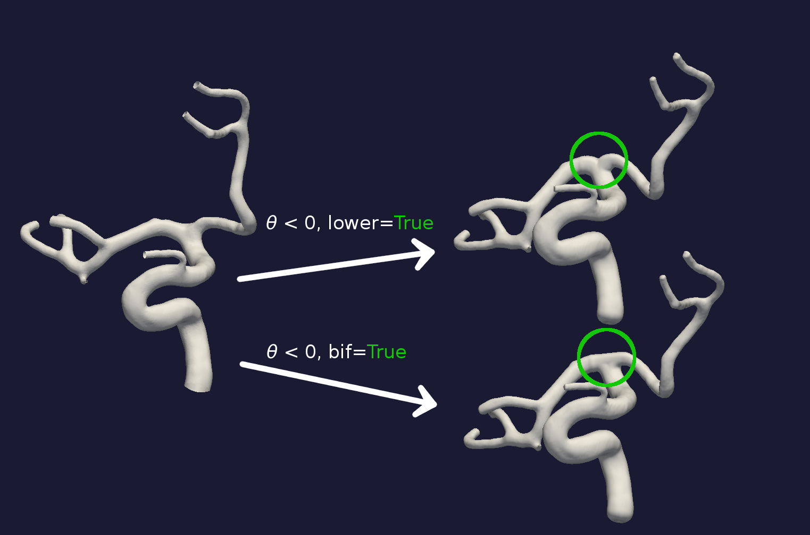
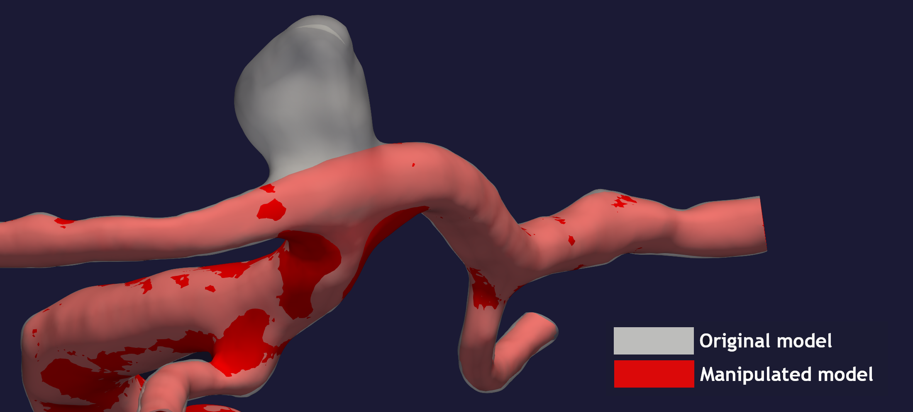

.. title:: Tutorial: Manipulate bifurcation

.. _manipulate_bifurcation:

================================
Tutorial: Manipulate bifurcation
================================
The goal with ``manipulate_bifurcations.py`` is to control the angle between two
daughter branches in a bifurcation, see Figure 1. The daughter branches can be
rotated towards each other, in other words reduce :math:`\theta`, or towards
the parent artery, increasing :math:`\theta`. The naming convention is that the
largest daughter branch is numbered 1, and the smallest 2.

The algorithm builds on previous work of Ford et al. [1]_

    Figure 1: An illustration of the goal of ``manipulate_bifurcation.py``.

In this tutorial, we are using the model with
`ID C0003 <http://ecm2.mathcs.emory.edu/aneuriskdata/download/C0003/C0003_models.tar.gz>`_
from the Aneurisk database. For the commands below we assume that there
is a file `./C0003/surface/model.vtp` relative to where you execute the command.

Shown in Figure 2 is the result of rotating the two daughter branched with both
a positive and negative angle.

.. figure:: angle_updown.png

  Figure 2: Rotation of daughter branches, in both a widening and narrowing of the bifurcation angle. 

You can reproduce the results in Figure 2 by running the two following commands::
    
    python manipulate_bifurcation.py --ifile C0003/model/surface.vtp --ofile C0003/model/rotate_pluss.vtp --angle 20
    python manipulate_bifurcation.py --ifile C0003/model/surface.vtp --ofile C0003/model/rotate_minus.vtp --angle -20

Inspecting Figure 2 closely you can observe an unphysiological "notch" in the bifurcation of the surface
with increased :math:`\theta`. One remedy is to add the flag ``--bif True`` and ``--lower True``,
which will output a smoother bifurcation, see Figure 3. Using both flags haven proven to give an improved surface,
and when used for computational fluid dynamics, a more physiological plausible wall shear stress [2]_.

  Figure 3: Rotation of daughter branches with a different reconstruction of the bifurcation.

The default is to rotate both branches, but if either ``--keep-fixed1`` or
``--keep-fixed2`` is set to **True**, daughter branch 1 or 2 will be kept
fixed, respectively. Furthermore, if both parameters are set to **True**
then the algorithm can be used to remove an aneurysm (a balloon-shaped bleb
on the artery), see Figure 4.

  Figure 4: Remove an aneurysm from the bifurcation.

To repoduce the output in Figure 4, you can run::
    python manipulate_bifurcation.py --ifile C0003/model/surface.vtp --ofile C0003/model/rotate_pluss.vtp --keep-fixed1 True --keep-fixed2 True --angle 0

For additional information, beyond this tutorial, on the script and
input parameters, please run ``python manipulate_bifurcation.py -h`` or confer with
the :meth:`manipulate_bifurcation`.

.. [1] Ford, M.D., Hoi, Y., Piccinelli, M., Antiga, L. and Steinman, D.A., 2009. An objective approach to digital removal of saccular aneurysms: technique and applications. The British Journal of Radiology, 82(special_issue_1), pp.S55-S61.
.. [2] Bergersen, A.W., Chnafa, C., Piccinelli, M., Gallo, C., Steinman, D.A., and Valen-Sendstad, K. In preparation. Automated and Objective Removal of Bifurcation Aneurysms: Incremental Improvements?
