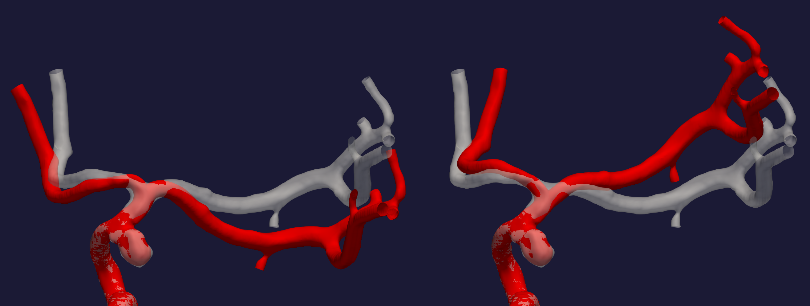
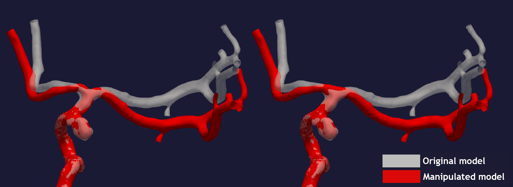
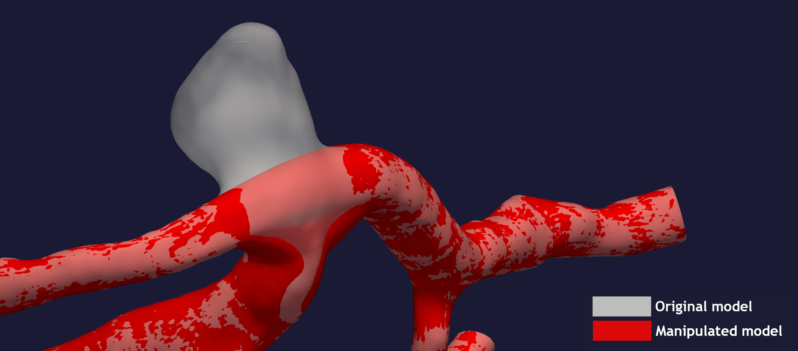

.. title:: Tutorial: Manipulate bifurcation

.. _manipulate_bifurcation:

================================
Tutorial: Manipulate bifurcation
================================
The goal with ``morphman-bifurcation`` is to control the angle between two
daughter branches in a bifurcation, see Figure 1. The daughter branches can be
rotated towards each other, in other words reduce :math:`\theta`, or towards
the parent artery, increasing :math:`\theta`. The naming convention is that the
largest daughter branch is numbered 1, and the smallest 2.

The algorithm builds on previous work of Ford et al. [1]_

.. figure:: Angle_variation.png

    Figure 1: An illustration of the goal of ``morphman-bifurcation``.

In this tutorial, we are using the model with
`ID C0005 <http://ecm2.mathcs.emory.edu/aneuriskdata/download/C0005/C0005_models.tar.gz>`_
from the Aneurisk database. For the commands below we assume that there
is a file `./C0005/surface/model.vtp`, relative to where you execute the command.
Performing the manipulation can be achieved by running ``morphman-bifurcation`` in the terminal, followed by the
respective command line arguments. Alternatively, you can execute the Python script directly,
located in the ``morphman`` subfolder, by typing ``python manipulate_bifurcation.py``. We have also created a 
demo folder where we show how to run this tutorial from a python script, please checkout the code from github to
run the demos.

Shown in Figure 2 is the result of rotating the two daughter branches with both
a positive and negative angle.

  Figure 2: Rotation of daughter branches, in both a widening and narrowing of the bifurcation angle. 

You can reproduce the results in Figure 2 by running the following command::

    morphman-bifurcation --ifile C0005/surface/model.vtp --ofile C0005/surface/rotate_plus.vtp --angle 20 --region-of-interest commandline --region-points 43.2 70.5 26.4 84.4 60.6 50.6 --poly-ball-size 250 250 250

for narrowing of the bifurcation angle, and similarly for widening of the bifurcation angle::

    morphman-bifurcation --ifile C0005/surface/model.vtp --ofile C0005/surface/rotate_minus.vtp --angle -20 --region-of-interest commandline --region-points 43.2 70.5 26.4 84.4 60.6 50.6 --poly-ball-size 250 250 250

Inspecting Figure 2 closely you can observe an unphysiological "notch" in the bifurcation of the surface
with increased :math:`\theta`. One remedy is to add the flag ``--bif True`` and ``--lower True``,
which will output a smoother bifurcation, as shown on the right side in Figure 3, compared with a model with no flags.
The results shown in Figure 3 can reproduced by
running the command::

    morphman-bifurcation --ifile C0005/surface/model.vtp --ofile C0005/surface/rotate_no_notch.vtp --angle -20 --bif True --lower True --region-of-interest commandline --region-points 43.2 70.5 26.4 84.4 60.6 50.6 --poly-ball-size 250 250 250

Using both flags have proven to give an improved surface,
and when used for computational fluid dynamics, a more physiological plausible wall shear stress [2]_.

  Figure 3: Rotation of daughter branches with a different reconstruction of the bifurcation.

The default is to rotate both branches, but if either ``--keep-fixed-1`` or
``--keep-fixed-2`` is set to **True**, daughter branch 1 or 2 will be kept
fixed, respectively. Furthermore, if both parameters are set to **True**
then the algorithm can be used to remove an aneurysm (a balloon-shaped bleb
on the artery), see Figure 4. To this specific tutorial, we have used the model
with `ID C0066 <http://ecm2.mathcs.emory.edu/aneuriskdata/download/C0066/C0066_models.tar.gz>`_
, which harbors an aneurysm located at the terminal bifurcation in the internal carotid artery.

  Figure 4: Remove an aneurysm from the bifurcation.

To reproduce the result shown in Figure 4, you can run the following command::

    morphman-bifurcation --ifile C0066/surface/model.vtp --ofile C0066/surface/removed_aneurysm.vtp --keep-fixed-1 True --keep-fixed-2 True --bif True --lower True --angle 0 --region-of-interest commandline --region-points 31.37 60.65 25.21 67.81 43.08 41.24 --poly-ball-size 250 250 250

For additional information, beyond this tutorial, on the script and
input parameters, please run ``morphman-bifurcation -h`` or confer with
the :meth:`manipulate_bifurcation`.

.. [1] Ford, M.D., Hoi, Y., Piccinelli, M., Antiga, L. and Steinman, D.A., 2009. An objective approach to digital removal of saccular aneurysms: technique and applications. The British Journal of Radiology, 82(special_issue_1), pp.S55-S61.
.. [2] Bergersen, A.W., Chnafa, C., Piccinelli, M., Gallo, C., Steinman, D.A., and Valen-Sendstad, K. In preparation. Automated and Objective Removal of Bifurcation Aneurysms: Incremental Improvements?
