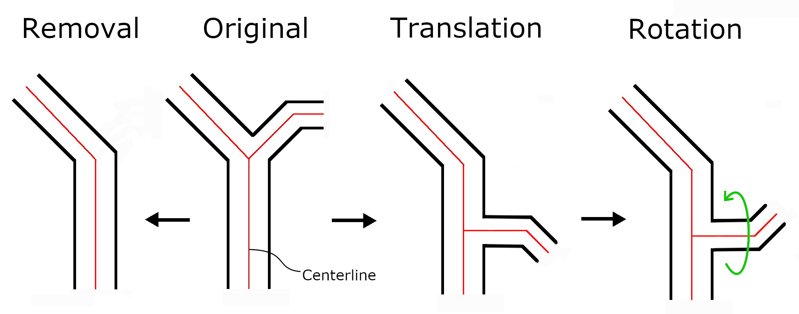
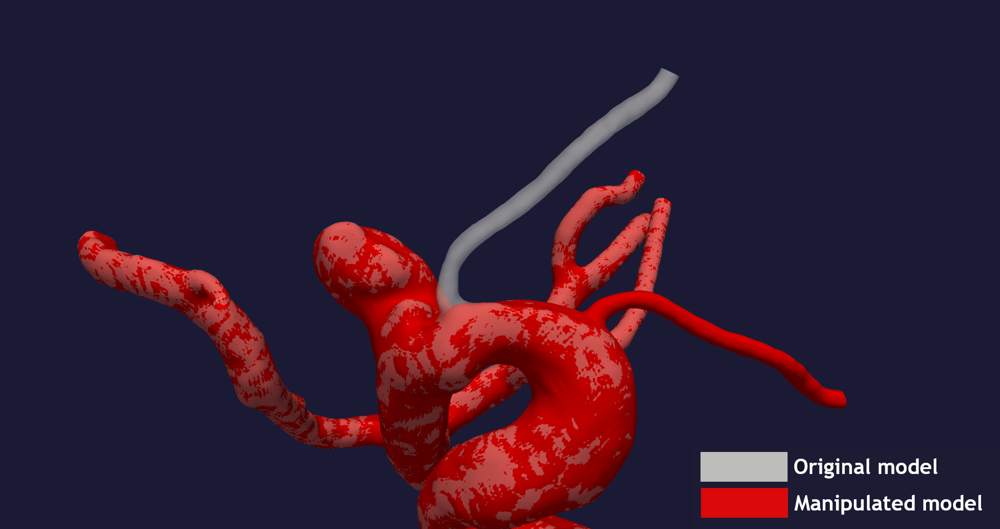
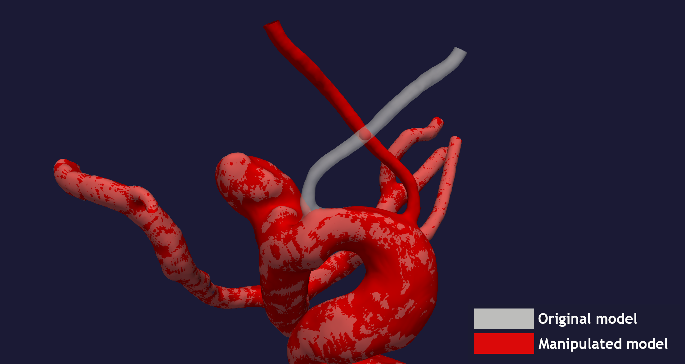
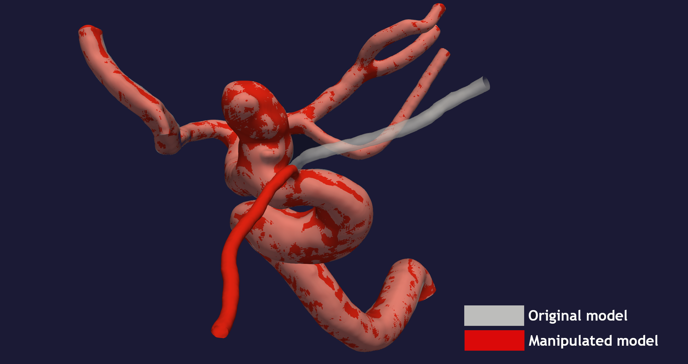
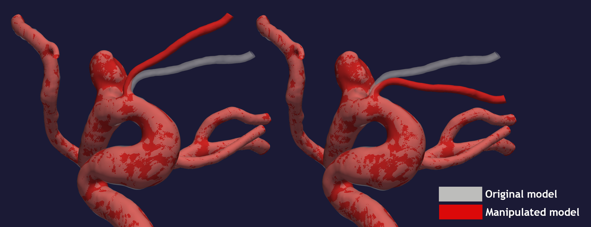
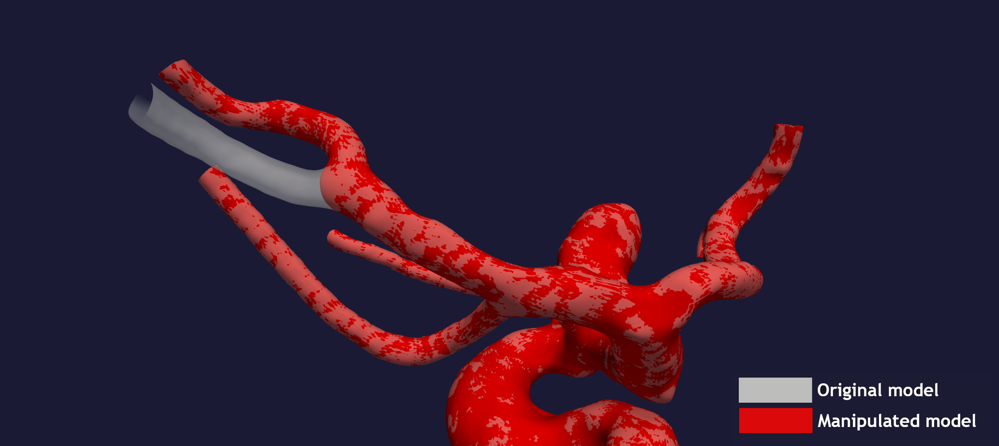

.. title:: Tutorial: Manipulate branch

.. _manipulate_branch:

===========================
Tutorial: Manipulate branch
===========================

The goal of ``manipulate_branch.py`` is to manipulate a specific branch of a
vascular model, either through pure tranlsation and rotation, or by completely removing it, as depicted in Figure 1.
In particular, we have defined a branch as any branch branching out of the longest tubular structure,
defined by the physical length of the tube.
The manipulation can be achieved by running ``morphman-branch`` in the terminal, followed by the
respective command line arguments. Alternatively, you can execute the Python script directly,
located in the ``morphman`` subfolder, by typing ``python manipulate_branch.py``. We have also created a
demo folder where we show how to run this tutorial from a Python script, please check out the code from GitHub to
run the demos.

  Figure 1: An illustration of the desired output from the method.

In this tutorial, we are using the model with
`ID C0002 <http://ecm2.mathcs.emory.edu/aneuriskdata/download/C0002/C0002_models.tar.gz>`_
from the Aneurisk database. For the commands below we assume that there is a
file `./C0002/surface/model.vtp`, relative to where you execute the command.

When using ``morphman-branch``, there are five main settings which can be provided by the user:

 * ``branch_number``: With branches ordered from 1 to N from upstream to downstream relative to the inlet, this number determines which branch is to be manipulated.
 * ``branch_loc``: The point on / closest to the surface, where the selected branch will be placed.
 * ``polar-angle``: How many degrees the manipulated branch will be rotated around the surface tangent vector, here denoted :math:`\theta`.
 * ``azimuth-angle``: How many degrees the manipulated branch will be rotated around the surface normal vector, here denoted :math:`\phi`.
 * ``remove_branch``: Either `True` or `False`, determining whether or not to remove the selected branch.
 * ``translation_method``: Flag which determines which method of translation to use. If `no_translation` is selected, the algorithm will only perform rotation.

Shown in Figure 2 is the result of moving the opthalmic artery of the vascular model to another part of the surface.

  Figure 2: Translation and rotation of the opthamlic artery,
  causing it to appear elsewhere on the vasular surface model.

To reproduce the surface model where the opthalmic artey has been moved, as shown in Figure 2, run::

    morphman-branch --ifile C0002/surface/model.vtp --ofile C0002/surface/moved_branch.vtp --branch-number 1 --branch-location 21.7 18.1 25.9 --translation-method commandline --poly-ball-size 250 250 250

As explained earlier, setting the `branch-number` equal to 1 corresponds to the first branch out of the main tube,
in this case the opthalmic artery of the ICA model.

Shown in Figure 3 is the result of moving the opthalmic artery of the vascular model to another part of the surface,
including a second azimuthal rotation around the new surface normal vector, which ranges :math:`\phi \in [0, 2 \pi ]`.

  Figure 3: Translation and rotation of the opthamlic artery, followed by azimuthal rotation around the new surface normal vector.

To reproduce the surface model where the opthalmic artey has been moved and rotated, as shown in Figure 3, run::

    morphman-branch --ifile C0002/surface/model.vtp --ofile C0002/surface/moved_and_rotated_branch.vtp --azimuth-angle 180 --branch-number 1 --branch-location 21.7 18.1 25.9 --translation-method commandline --poly-ball-size 250 250 250

Notice how the `azimuth-angle` setting is given in degrees, although converted to radians in the main algorithm.

The model can alternativly undergo pure rotation at the original position of the branch to be manipulated, by setting the
``--translation-method`` flag to ``no_translation`` and providing any :math:`\theta > 0` or :math:`\phi > 0`.
We have provided an example of pure azimuthal rotation around the base of the branch in Figure 4, where the
opthalmic artery has been rotated 120 degrees from its initial angle, :math:`\phi = 120`.

  Figure 4: Azimuthal rotation of the opthamlic artery, around its initial position.

To reproduce the surface model where the opthalmic artey has been rotated, as shown in Figure 4, run::

    morphman-branch --ifile C0002/surface/model.vtp --ofile C0002/surface/azimuth_rotated_branch.vtp --translation-method no_translation --azimuth-angle 120 --branch-number 1  --poly-ball-size 250 250 250

We have also provided two example of pure polar rotation around the axis approximating the surface tangent vector, shown in Figure 5.
The example is performed for rotations with :math:`\theta = 20` and :math:`\theta = -20`, respectively.

  Figure 5: Polar rotation of the opthamlic artery, around a surface tangent vector as axis.

To reproduce the surface models as shown in Figure 5, run::

    morphman-branch --ifile C0002/surface/model.vtp --ofile C0002/surface/polar_rotated_branch_up.vtp --translation-method no_translation --polar-angle 20 --branch-number 1  --poly-ball-size 250 250 250

    morphman-branch --ifile C0002/surface/model.vtp --ofile C0002/surface/polar_rotated_branch_down.vtp --translation-method no_translation --polar-angle -20 --branch-number 1  --poly-ball-size 250 250 250

Finally, in Figure 6 is the result of removing an arbitrary branch.

  Figure 6: Removal of an arbitrary branch, in this case the fourth major branch away from the inlet.

To reproduce the surface model where a branch has been removed, as shown in Figure 6, run::

    morphman-branch --ifile C0002/surface/model.vtp --ofile C0002/surface/removed_branch.vtp --remove-branch True --branch-number 4 --poly-ball-size 250 250 250

For additional information, beyond this tutorial, on the script and
input parameters, please run ``morphman-branch -h`` or confer with
the :meth:`manipulate_branch`.
