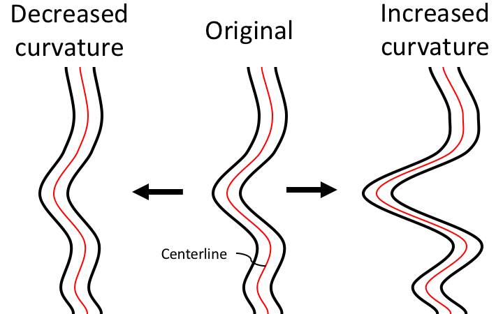
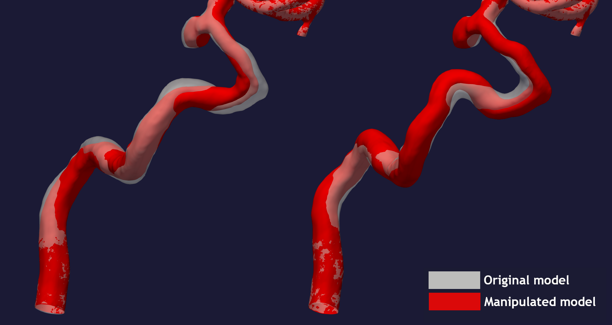

.. title:: Tutorial: Manipulate curvature

.. _manipulate_curvature:

==============================
Tutorial: Manipulate curvature
==============================

The goal of ``manipulate_curvature.py`` is to increase or decrease the
total curvature/torsion in a vascular segment, see Figure 1 for an example.

  
  Figure 1: An illustration of the desired output from the method.

In this tutorial, we are using the model with
`ID C0005 <http://ecm2.mathcs.emory.edu/aneuriskdata/download/C0005/C0005_models.tar.gz>`_
from the Aneurisk database. For the commands below we assume that there is a
file `./C0005/surface/model.vtp`, relative to where you execute the command.

In ``manipulate_curvature.py``, there are three options for setting
``region-of-interest``:

 * ``manual``: Manual selection, based on clicking on a surface
 * ``commandline``: Provide the points on the centerline
 * ``first_line``: The section between the inlet and the first bifurcation.

For each point along the centerline in the region of interest
we need a direction to move the new geometry. To obtain the direction,
we compute the distance between the original and a smoothed
centerline. Using a gaussian smoothing, the new centerline will gradually converge
towards a straight line, depending on the number of iterations and smoothing factor.
We can then easily choose to move each point in the Voronoi diagram correspondingly,
and thus obtain a new surface, like depicted to the left in Figure 2. By simply
inverting the direction of the vector, we can also increase the overall curvature,
see the right most surface in Figure 2.

  Figure 2: Sharpened and smoothened version of the siphon.

To reproduce the surface model with decreased total curvature shown on the left in Figure 2, run::

        python manipulate_curvature.py --ifile C0005/surface/model.vtp --ofile C0005/surface/model_curvature_decreased.vtp --smooth-line True --iterations 100 --smooth-factor-line 1.8  --region-of-interest first_line --poly-ball-size 250 250 250

To reproduce the surface model with increased total curvature shown on the right in Figure 2, run::

        python manipulate_curvature.py --ifile C0005/surface/model.vtp --ofile C0005/surface/model_curvature_increased.vtp --smooth-line False --iterations 100 --smooth-factor-line 1.8  --region-of-interest first_line --poly-ball-size 250 250 250

As shown in the command above, increased total curvature is achieved by setting the command line argument ``--smooth-line`` to **False**.

For additional information, beyond this tutorial, on the script and
input parameters, please run ``python manipulate_curvature.py -h`` or confer with
the :meth:`curvature_variations.curvature_variations`.
