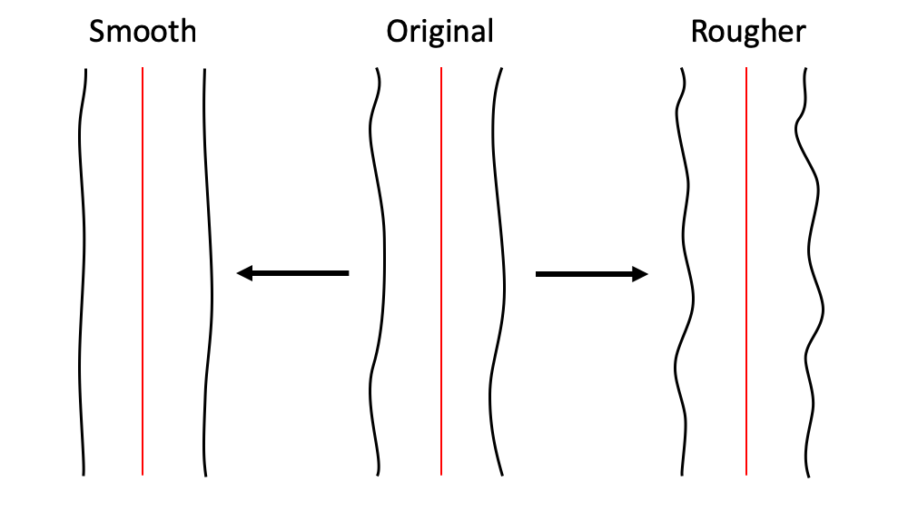
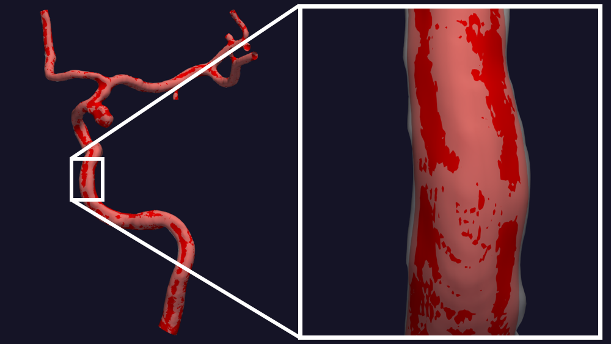
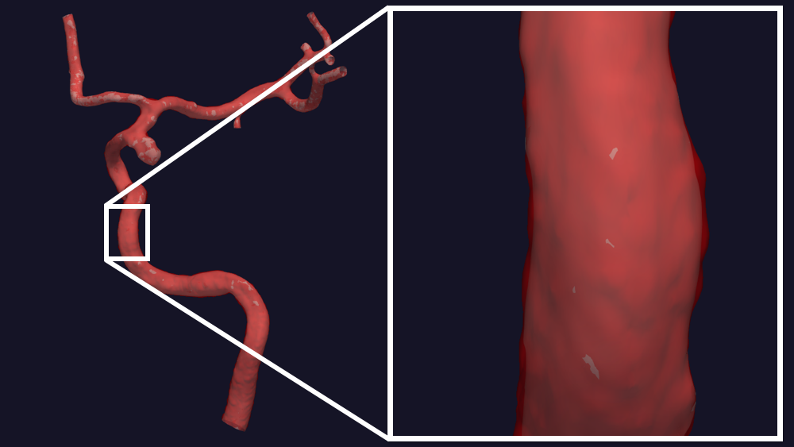

.. title:: Tutorial: Manipulate surface roughness

.. _manipulate_surface:

======================================
Tutorial: Manipulate surface roughness
======================================
The goal with ``morphman-surface`` is to control level of high-frequent noise on 
the surface, or surface roughness if you like, see Figure 1. To achive this we
either remove or add points to the Voronoi diagram. An advantage of this, compared
to more classical smoothing methods, is that the change in surface is purely local,
and does not effect the cross-sectional area.

The algorithm builds on previous work of Ford et al. [1]_

    Figure 1: An illustration of the goal of ``morphman-surface``.

In this tutorial, we are using the model with
`ID C0005 <http://ecm2.mathcs.emory.edu/aneuriskdata/download/C0005/C0005_models.tar.gz>`_
from the Aneurisk database. For the commands below we assume that there
is a file `./C0005/surface/model.vtp`, relative to where you execute the command.
Performing the manipulation can be achieved by running ``morphman-surface`` in the terminal, followed by the
respective command line arguments. Alternatively, you can execute the Python script directly,
located in the ``morphman`` subfolder, by typing ``python manipulate_surface.py``. We have also created a 
demo folder where we show how to run this tutorial from a Python script, please check out the code from GitHub to
run the demos.

Shown in Figure 2 is the result of smoothing the surface.

  Figure 2: Remove high-frequent noise from the surface.

You can reproduce the results in Figure 2 by running the following command::

    morphman-surface --ifile C0005/surface/model.vtp --ofile C0005/surface/smooth.vtp --poly-ball-size 250 250 250

Shown in Figure 2 is the result of adding noise to the surface.

  Figure 3: Add high-frequent noise to the surface.

You can reproduce the results in Figure 3 by running the following command::

    morphman-surface --ifile C0005/surface/model.vtp --ofile C0005/surface/noise.vtp --poly-ball-size 250 250 250 --smooth False --noise True --frequency 0 --frequency-deviation 1 -l 0.8 -u 0.9 --radius-min 1.1 --radius-max 1.5

For additional information, beyond this tutorial, on the script and
input parameters, please run ``morphman-surface -h`` or confer with
the :meth:`manipulate_surface`.

.. [1] Ford, M.D., Hoi, Y., Piccinelli, M., Antiga, L. and Steinman, D.A., 2009. An objective approach to digital removal of saccular aneurysms: technique and applications. The British Journal of Radiology, 82(special_issue_1), pp.S55-S61.
